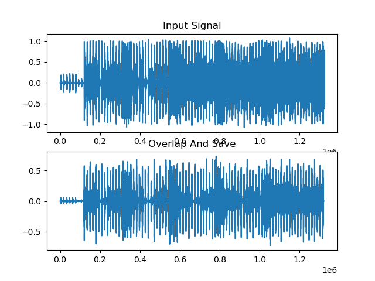
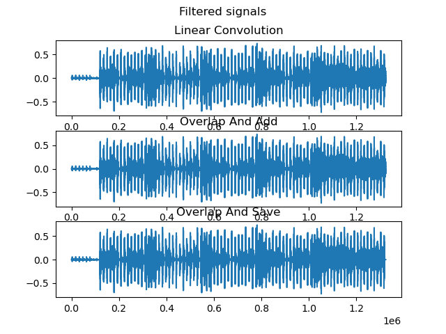

# Tarefa 3: Filtragem de sinal com DFT
## Aluno: Otho Teixeira Komatsu
## Matrícula: 170020142

Nesse projeto foi utilizado o Python 3.8, utilizando principalmente as libs 
*SciPy*, *Numpy* e *MatPlotLib*. 

O script foi baseado no template em matlab disponibilizado na tarefa, 
sendo adaptada para o **Python** e suas libs.

Assim, de início é carregado o sinal do áudio no modo mono em um array `x`, e é 
carregado o arquivo dos coeficientes do filtro passa baixa em csv para outro 
array `h`. 

Essa etapa então concluída segue-se para os processos de filtragem:

## 1. Convolução

Nessa etapa foi necessário somente utilizar de uma função da biblioteca SciPy 
conforme o código:

```y_convolution = scipy.signal.convolve(h, x)```

O resultado obtido segue-se:


## 2. Overlap and Add

A filtragem *overlap and add* foi realizada conforme a indicada na bibliografia.
Seguindo o modelo do livro, as etapas do algoritmo correspondem as linhas do 
código conforme relacionada abaixo:

> (i)   Divide $x[n]$ into length-N blocks $x_{m}[n]$. [linha 56]
> 
> (ii)  Zero pad $h[n]$ and each block $x_{m}[n]$ to length $(N + K - 1)$. [linha 60 e 63]
> 
> (iii) Perform the circular convolution of each block using the length - $(N + K - 1)$ DFT. 
> [linha 67 e 68]
> 
> (iv)  Add the results to $y$. [linha 71 e 72]

Desse procedimento, foi obtido o resultado:


## 3. Overlap and Save

Por fim, de forma análoga o algoritmo do código segue o modelo do livro, conforme a seguir:

> (i) Divide $x[n]$ into length-N blocks $x_m[n]$.
> 
> (ii) Zero pad $h[n]$ and each block $x_{m}[n]$ to length $(N + K - 1)$.
> 
> (iii) Perform the circular convolution of each block using the length - $(N + K - 1)$ DFT.
> 
> (iv) Add the results to $y$.

Desse procedimento, foi obtido o resultado:



## 4. Conclusões

Pelos gráficos acima, percebe-se uma mudança na distribuição dos valores do sinal, se tornando menos densa, porém seu formato se mantém. Comportamento comum em processamentos que envolvem filtragem passa-baixa.

Analisando os 3 sinais comparativamente na figura 4, pode-se observar que os resultados dos sinais processados, ou seja, filtrados pelo passa-baixa apresentam valores bastante análogos como esperado, já que esses 3 métodos se tratam de caminhos diferentes para podermos obter um sinal entrada x filtrado por um filtro a partir de sua resposta ao impulso h. 



Apesar da grande semelhança, é perceptível pequenas diferenças entre os sinais em locais muitos pontuais como no final do Overlap and save e o resto dos sinais processados. Uma possível causa é a má escolha do N e do intervalo de processamento do sinal x no código, prejudicando a coleta dos valores do sinal saída nas últimas amostras.

Mesmo com essa questão, a tarefa permitiu verificar que os 3 métodos permitem realizar uma mesma operação e obter, consequentementem os mesmos resultados.

## 5. Bibliografia
Diniz P.S.R., et al, Digital signal processing System analysis and design